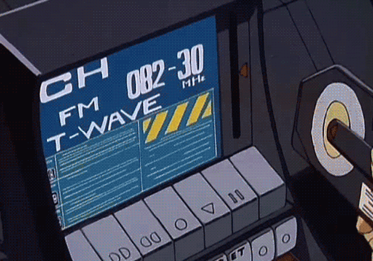
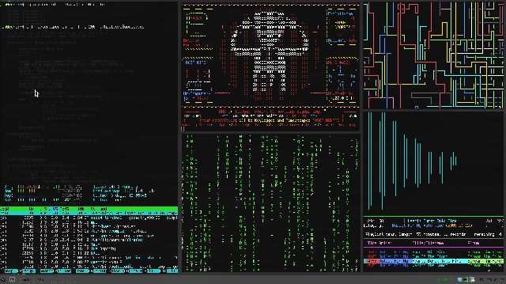

<div align="center">

# ⚡ TERMINAL ⚡

</div>


```plaintext
> Sistema em inicialização...
> [██████             ] 30%
> INTERFACE FOUNDING...

 __   __     ______     __  __     ______     ______     __    __     ______     __   __     ______     ______     ______    
/\ "-.\ \   /\  ___\   /\ \/\ \   /\  == \   /\  __ \   /\ "-./  \   /\  __ \   /\ "-.\ \   /\  ___\   /\  ___\   /\  == \   
\ \ \-.  \  \ \  __\   \ \ \_\ \  \ \  __<   \ \ \/\ \  \ \ \-./\ \  \ \  __ \  \ \ \-.  \  \ \ \____  \ \  __\   \ \  __<   
 \ \_\\"\_\  \ \_____\  \ \_____\  \ \_\ \_\  \ \_____\  \ \_\ \ \_\  \ \_\ \_\  \ \_\\"\_\  \ \_____\  \ \_____\  \ \_\ \_\ 
  \/_/ \/_/   \/_____/   \/_____/   \/_/ /_/   \/_____/   \/_/  \/_/   \/_/\/_/   \/_/ \/_/   \/_____/   \/_____/   \/_/ /_/ 

> INITIATING HACKER INTERFACE...
> ESTABLISHING CONNECTIONS...
> [███████████████████] 100%
> TARGET ACQUIRED: github.com
```
<div align="center">



</div>

```bash
$ connect --target https://github.com/daniel
> CONNECTION ESTABLISHED...

$ status --check
> SYSTEM ONLINE, NO VULNERABILITIES DETECTED.

$ run-project --name="NeonQuest"
> EXECUTING MMORPG SYSTEM...
> GAME ONLINE. VISIT: [glitch.me](https://daniel.glitch.me)

$ ls -all
> LeonAI/      # Plataforma inteligente de assistência
> NeonQuest/   # Jogo MMORPG baseado em texto
> 4Pay/        # Gerenciamento financeiro com PIX

$ ls -techs
> BACKEND: Typescript, Python (FastAPI)
> FRONTEND: Next.js, React
> SAP: FI Integrations
> DESIGN: Figma, Blender

$ whoami
> Daniel: Developer | Head | Loading...  
```

---

### 🌐 **Conecte-se**

<div align="center">

📟 **LinkedIn:** [Conecte-se comigo](https://www.linkedin.com/in/daniel)  
📡 **Portfolio:** [Entre no Mainframe](https://daniel.glitch.me)  
📧 **Email:** daniel@cybermail.com  

</div>

<div align="center">

"Não é um ataque, é apenas um showcase."
**Daniel**

</div>
